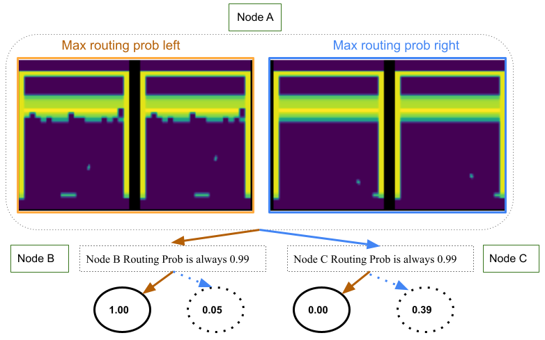
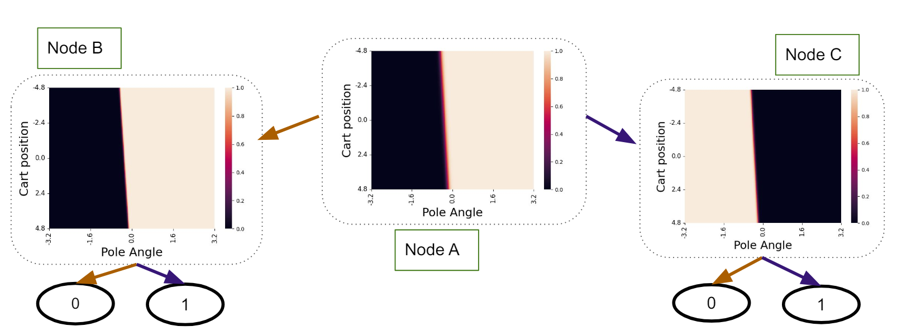

# Can Differentiable Decision Trees Enable Interpretable Reward Learning from Human Feedback? #
<p align="center">
  <a href="https://arxiv.org/abs/2306.13004">View on ArXiv</a> |
  <a href="https://sites.google.com/view/ddt-rlhf/">Project Website</a>
</p>

***Akansha Kalra, Daniel S. Brown***
This repository contains a code used to conduct experiments reported in the paper on Atari , Visual MNIST Gridworls and Cartpole. 
<p align=center>
  
</p>

<p align=center>
  
</p>


## If you find this repository is useful in your research, please cite the paper:
```
@article{kalra2024differentiable,
    title={Can Differentiable Decision Trees Enable Interpretable Reward Learning from Human Feedback?},
    author={Kalra, Akansha and Brown, Daniel S.},
    journal={Reinforcement Learning Journal},
    volume={4},
    pages={1887--1910},
    year={2024}
}

```